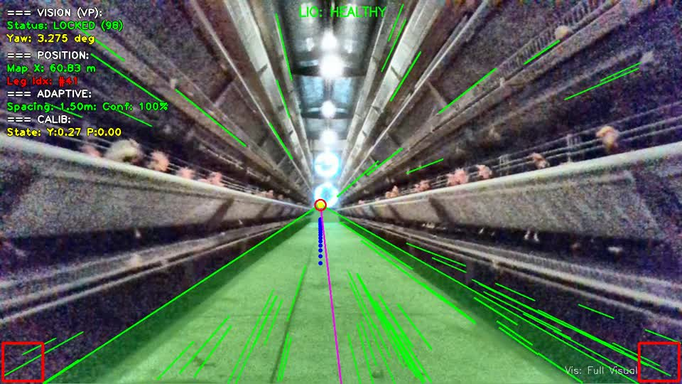

# S2P-SLAM

Code snapshot for the manuscript:

**S2P-SLAM: Structural-periodicity and unit-sphere polarity constraints for visual–LiDAR–inertial SLAM in a caged poultry house**

This repository provides the ROS source and configuration used for
poultry-house localization and spatiotemporal semantic mapping.

## Repository layout

```text
src/
  faster-lio/                  LiDAR-inertial odometry frontend and poultry-house configuration
  semantic_octomap_mapping/    Semantic OctoMap mapping node, launch file, and RViz config
docs/
  demonstration_materials.md   Demonstration-material index and release notes
  s2p_slam_vp_debug_rgb_60s.mp4  60 s diagnostic demonstration video
```

The detailed method-to-code correspondence and the input-frame assumptions are
documented in
[`src/semantic_octomap_mapping/METHOD_ALIGNMENT.md`](src/semantic_octomap_mapping/METHOD_ALIGNMENT.md).

The full experimental system also used standard ROS driver packages for LiDAR, IMU/AHRS, and Intel RealSense RGB-D cameras. These driver packages are not vendored in this lightweight release to keep the repository small and reviewable.

## Key configuration files

```text
src/faster-lio/config/cp_lio.yaml
src/faster-lio/launch/cp_lio.launch
src/semantic_octomap_mapping/launch/mapping.launch
```

## Environment

The system was developed with:

- Ubuntu 20.04
- ROS Noetic
- PCL
- OpenCV
- Eigen
- GTSAM
- Intel RealSense SDK / ROS wrapper

## Build

Create a catkin workspace and place this repository content inside it:

```bash
mkdir -p ~/s2p_slam_ws/src
cp -r src/* ~/s2p_slam_ws/src/
cd ~/s2p_slam_ws
catkin_make -DCMAKE_BUILD_TYPE=Release
source devel/setup.bash
```

Install or clone the required sensor driver packages according to your hardware setup before building the full online system.

Run the aligned backend and mapper with:

```bash
roslaunch semantic_octomap_mapping mapping.launch
```

This launch file starts the bundled Faster-LIO front end by default.  If an
external LIO instance is already publishing the configured odometry and point
cloud topics, use `start_faster_lio:=false`.

The matched removals can be selected without editing source code through the
launch arguments `enable_periodicity`, `enable_virtual_rail`, `enable_vp`,
`enable_hybrid`, `enable_semantic_gate`, and `enable_stsm`.  The manuscript's
combined semantic-gate/STSM removal sets the last two arguments to `false`.

Camera intrinsics and the nominal camera-to-body transform in the launch file
must be replaced when the sensor installation changes.  The optional
`/s2p/lio_converged` Boolean topic supplies the registration/deskew convergence
gate used during recovery; the LIO odometry covariance must also be positive
definite before recovery is accepted.

The package includes static regression tests for manuscript-critical choices:

```bash
python3 -m unittest discover src/semantic_octomap_mapping/test -v
```

## Demonstration materials

The repository includes a 60 s demonstration video recorded directly from the ROS image topic `/vp_debug_rgb`:

[](https://raw.githubusercontent.com/Jiangjiacheng-scau/S2P-SLAM/main/docs/s2p_slam_vp_debug_rgb_60s.mp4)

Click the preview above to play the MP4 directly in the browser. If your browser downloads the file instead, use the direct fallback link: [S2P-SLAM 60 s diagnostic visualization](https://raw.githubusercontent.com/Jiangjiacheng-scau/S2P-SLAM/main/docs/s2p_slam_vp_debug_rgb_60s.mp4).

Additional notes are listed in [docs/demonstration_materials.md](docs/demonstration_materials.md).

Large raw ROS bags and point-cloud maps are intentionally excluded from Git.

## Excluded large files

The following file types are intentionally not tracked:

- ROS bags: `*.bag`
- Point clouds/maps: `*.pcd`, `*.ply`
- Raw videos: `*.avi`, `*.mov`, `*.mkv`
- Build products: `build/`, `devel/`, `install/`
